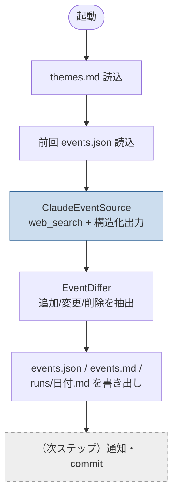

# イベント収集プロトタイプ 設計書

`summary/260621/04-event-collector.md` の精査を受けた、プロトタイプの設計。
本ステップでは **コア（収集 → events.md 生成 → 差分記録）** を C# で実装する。通知・GitHub Actions 連携は次ステップ。

## スコープ

| 含む（本ステップ） | 含まない（次ステップ） |
|--------------------|------------------------|
| テーマ設定の読み込み | Discord/Gmail 通知 |
| Claude + web_search による収集 | GitHub Actions(cron) ワークフロー |
| 構造化出力（JSON）への整形 | テーマの自律拡張ロジック本体 |
| events.md / events.json 生成 | 自動コミット |
| 前回との差分抽出・runs ログ | |

## データ構造

```
events/
├── DESIGN.md                 … 本書
├── config/
│   ├── themes.md             … 収集テーマ（人間 + Claude が編集）
│   └── participated.md       … 参加イベントログ（テーマ拡張の根拠）
├── data/
│   └── events.json           … 機械可読スナップショット（差分の真実の源）
├── events.md                 … 人間向けの最新一覧（毎回再生成）
└── runs/
    └── <yyyy-MM-dd>.md        … 実行ごとの差分記録
```

### なぜ events.json と events.md を分けるか

- **events.json** … 差分検知の基準。前回値と機械的に比較する。md をパースし直すより堅牢。
- **events.md** … 人間が読む用。GitHub 上でそのまま閲覧できる。

## 処理フロー



## コンポーネント（C#）

| クラス | 役割 |
|--------|------|
| `Program` | 全体のオーケストレーション（各サービスを順に呼ぶ） |
| `ThemeStore` | `themes.md` からテーマ一覧を読む |
| `ClaudeEventSource` | Claude API（`web_search` + 構造化出力）でイベントを収集 |
| `EventDiffer` | 前回スナップショットと比較し追加/変更/削除を抽出 |
| `MarkdownRenderer` | `events.md` と `runs/日付.md` を生成 |
| `Models/Events.cs` | `EventItem` / `CollectionResult` / `DiffResult` |

## 技術選定メモ

- **モデル：Claude Sonnet 4.6**（`claude-sonnet-4-6`）
  - `web_search_20260209`（動的フィルタリング）と構造化出力の両方に対応する必要があり、Haiku 4.5 は `_20260209` 非対応のため不可。コストと品質のバランスで Sonnet を採用。
- **収集：`web_search` サーバーツール** + **構造化出力（`output_config.format`）** で、検索結果を直接 JSON スキーマに整形する。
- **APIキー**：`ANTHROPIC_API_KEY` 環境変数から読む（コードに埋め込まない）。

## 既知の TODO（スケルトン段階で未完の箇所）

1. **サーバーツールのループ処理**：`web_search` は内部で複数反復し `stop_reason: "pause_turn"` を返すことがある。現状は単発呼び出し。実運用では pause_turn の継続ループを追加する。
2. **web_search × 構造化出力の相互作用**：この組み合わせは実行時に挙動を確認する。必要なら「検索 → 整形」の2段（ツール利用ループ後に最終整形呼び出し）に分離する。
3. **テーマ自律拡張**：`participated.md` を参照して Claude にテーマを提案・追記させるロジックは次ステップ。
4. **通知・Actions・自動コミット**：次ステップ。

## 次ステップの候補

1. 実機で1回動かしてトークン消費・出力品質を計測（精査で示した「1回数円〜数十円」を検証）。
2. Discord Webhook 通知を追加。
3. GitHub Actions（cron）で定期実行し、差分があれば自動コミット。
