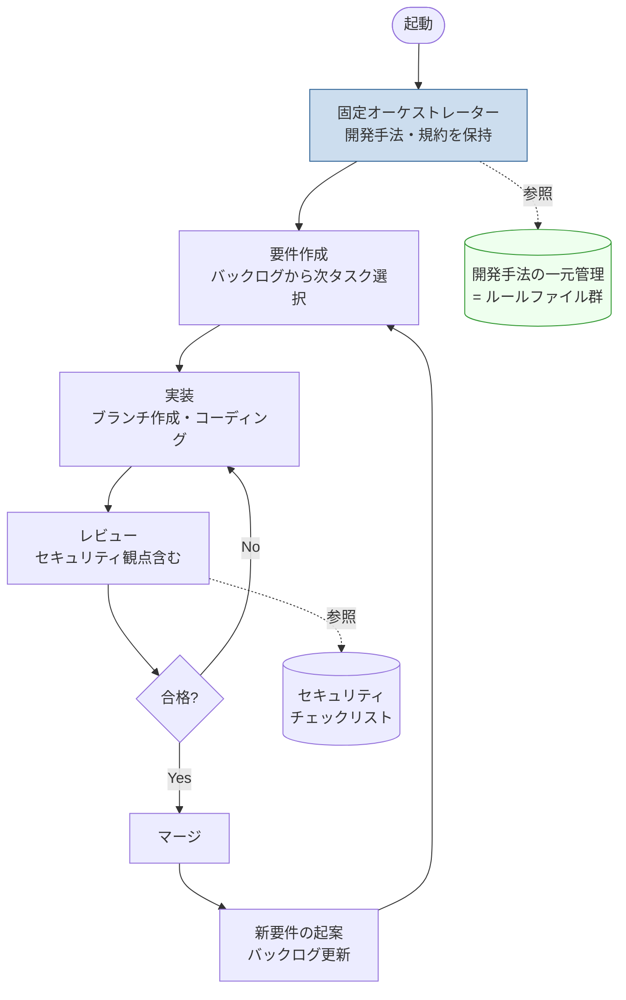
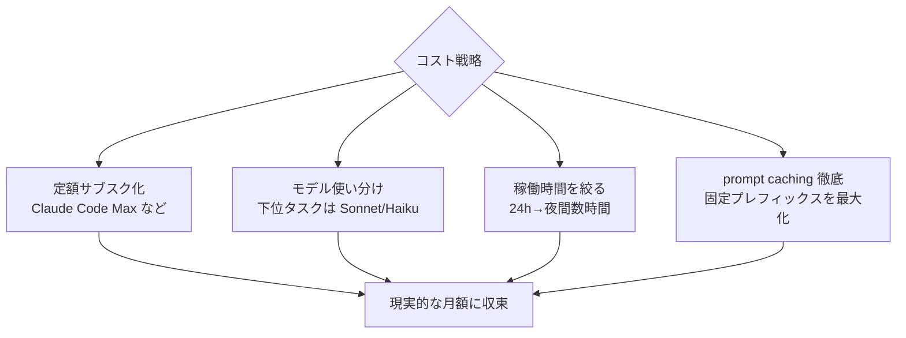

# #1 Claude による24時間自律開発オーケストレーション

## アイデア概要（idea.md より）

- Claude が自律的に「要件作成 → 実装 → レビュー → マージ → 新要件作成」を24時間回し続ける
- 開発・レビュー要件にセキュリティホール観点を組み込む
- 開発要件を一元管理し、毎回書き直さなくてよい設計にする
- オーケストレーター役の Claude を固定することで、順守すべき開発手法を固定的に管理・拡張可能にする

## 結論：△ 技術的には可能。最大の壁は「コスト」

技術的な実現手段は既に存在する（後述）。問題は **24時間 Claude を動かし続ける費用** であり、ここを設計しないと月数万円規模になりうる。

## アーキテクチャ案

固定オーケストレーターが「開発手法（=順守ルール）」を保持し、ループの各フェーズを駆動する構成。

### 「開発手法の一元管理」の実現方法

idea.md が求める「毎回書き直さなくてよい設計」は、以下のいずれか（または併用）で実現できる。

| 手段 | 内容 | 向き |
|------|------|------|
| `CLAUDE.md` / プロジェクト規約ファイル | リポジトリ直下に開発手法を記述。Claude が毎セッション参照 | ルールのバージョン管理に最適 |
| Claude Managed Agents（Beta） | エージェント設定（system / tools）を**永続・バージョン管理**。一度作成しID参照 | 「オーケストレーターの固定」に合致 |
| スキル（SKILL.md） | タスク特化の手順を必要時のみロード | フェーズ別の手順分離 |

「オーケストレーターを固定する」という発想は、Managed Agents の「Agent を一度作成し、毎セッションIDで参照する」モデルと完全に一致する。バージョン更新時も過去バージョンを保持できるため、ロールバックや A/B も可能。

## コスト試算（最重要）

24時間連続でエージェントループを回す場合の概算。**現行料金（2026-06時点）**:

| モデル | 入力 $/Mtok | 出力 $/Mtok | キャッシュ読取 概算 |
|--------|-------------|-------------|---------------------|
| Opus 4.8 | $5 | $25 | 約 $0.5（0.1×） |
| Sonnet 4.6 | $3 | $15 | 約 $0.3 |
| Haiku 4.5 | $1 | $5 | 約 $0.1 |

### Opus 4.8 で24時間回した場合の概算

前提（保守的なエージェントループ）:
- 平均 30秒に1ターン → 約 2,880 ターン/日
- 1ターンあたり：入力 約30k tokens（大半は prompt cache 読取）、出力 約1.5k tokens

| 項目 | 日次トークン | 単価 | 日額 |
|------|-------------|------|------|
| 入力（キャッシュ読取中心） | 30k × 2,880 ≈ 86.4M | $0.5/M | 約 $43 |
| 出力 | 1.5k × 2,880 ≈ 4.3M | $25/M | 約 $108 |
| **合計** | | | **約 $150/日 ≈ $4,500/月** |

> ⚠️ あくまで桁感の概算。実負荷で必ず計測すること。だが「Opus を従量課金で24時間回す」と**月数千ドル規模**になりうる点は動かない。idea.md の「月5000円」では到底収まらない。

### コストを現実に収める選択肢

1. **定額サブスクで開発ループを回す**：従量 API ではなく Claude Code の定額プラン（月100〜200ドル規模）で開発作業をカバーすれば、トークン課金の青天井を回避できる。「自律開発の費用」と「デプロイ済みサービスの API 費用」は分けて管理する。
2. **モデルの使い分け**：要件起案・レビューは Opus、定型実装は Sonnet/Haiku のサブエージェントに委譲。
3. **稼働時間の限定**：「24時間」を額面通りやらず、夜間バッチ的に数時間に絞るだけで桁が変わる。
4. **prompt caching の徹底**：固定オーケストレーター＝固定プレフィックスなので、キャッシュ読取（0.1×）が効きやすい。規約・ツール定義を先頭に固定し、可変部を末尾に置く設計が必須。

## セキュリティ要件の組み込み

idea.md の「レビュー要件にセキュリティホール観点を追記」は以下で実現:

- レビュー用スキル／チェックリストに OWASP 観点・機密情報スキャンを明文化し、オーケストレーターが必ず参照
- `security-review` 相当の自動レビューをマージ前ゲートに組み込む
- 公開リポジトリ運用のため、push 前のシークレットスキャンを必須化

## リスクと対策

| リスク | 対策 |
|--------|------|
| コスト暴走 | API 利用上限アラート、Task Budget による反復・トークン上限、定額プラン化 |
| 自律マージによる品質劣化 | マージ前のテスト・レビューゲート必須化、ヒューマンチェックポイント |
| 無限ループ・要件の発散 | バックログ上限、停止条件、定期的な人間レビュー |
| セキュリティホール混入 | 上記セキュリティ要件の固定化 |

## 推奨

- **段階導入**：いきなり24時間完全自律ではなく、まず #4（イベント収集）で自律ループの型と監視を確立する。
- **基盤として Managed Agents もしくは CLAUDE.md ベースの規約管理**を採用し、「オーケストレーターの固定」を実装する。
- **コストは定額化＋稼働時間制御**で現実的な水準に収める。
