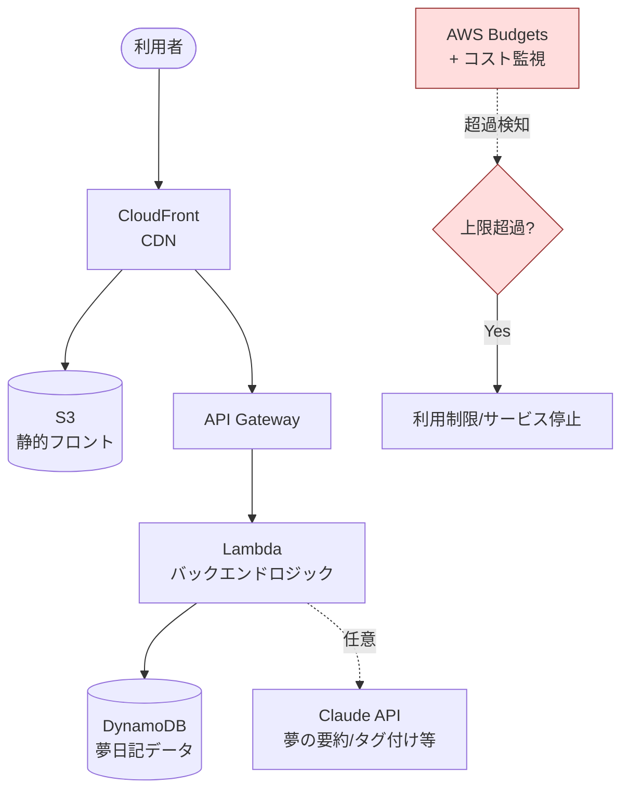
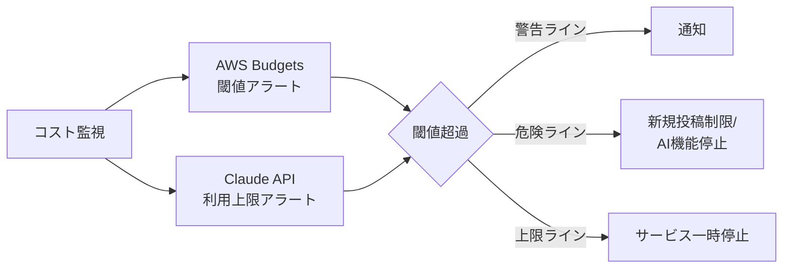

# #2 夢日記共有サイト（自律実装＆デプロイ）

## アイデア概要（idea.md より）

- 夢日記を共有できる Web サイトをリリースする
- 完全に自律的に実装させ、デプロイまで完結させる
- AWS や Claude API が **月5000円程度の範囲**に収まるならリリースする
- 給与の一部を個人開発のメンテに充てる前提
- **特定金額を超えたらサービスダウン or 利用制限** をかける設計にする

## 結論：○ 実現性は高い。月5000円以内は十分達成可能

サーバーレス構成なら小規模 Web サービスの運用費は月数十円〜数百円規模に収まり、5000円（約$33）には十分な余裕がある。鍵は **コスト超過時の自動制御** を最初から組み込むこと。

## 推奨アーキテクチャ（AWS サーバーレス）

| 層 | サービス | 役割 |
|----|----------|------|
| 配信 | CloudFront + S3 | 静的フロント（SPA）をCDN配信 |
| API | API Gateway + Lambda | 投稿・閲覧・認証などのバックエンド |
| データ | DynamoDB | 夢日記の保存。常時無料枠が大きい |
| AI（任意） | Claude API | 夢の要約・自動タグ付け・感情分析など |

## 運用コスト試算（2026時点）

小規模 Web アプリのサーバーレス運用費の目安:

| 規模 | 月額目安 |
|------|----------|
| ローンチ直後・低トラフィック | **$0.5 〜 数ドル**（多くが無料枠内） |
| API 10万回/月 + 軽い利用 | **$5 〜 $20** |

- AWS 無料枠：Lambda は月100万リクエスト・40万GB秒、DynamoDB は25WCU/25RCU・25GBストレージが常時無料。
- 個人規模の夢日記サイトであれば、**AWS 費用は月数百円以内**に収まる可能性が高く、5000円の枠には大きな余裕がある。

### Claude API を使う場合の上乗せ

夢の自動要約・タグ付けに Claude を使う場合の概算（1投稿あたり）:

- 入力 約2k tokens + 出力 約0.5k tokens を Haiku 4.5（$1/$5）で処理 → 1投稿あたり **約 $0.0045（0.7円程度）**
- 1日100投稿でも月 約 $13.5（約2000円）

→ **AWS + Claude API 合算でも、利用規模を見ながらなら5000円以内に収まる設計が可能**。要約は Haiku を使う、または投稿時のみ実行しキャッシュする、などで抑える。

## 最重要：コスト超過時の自動制御

idea.md が明記する「特定金額を超えたらサービスダウン or 利用制限」は必須機能。以下で実装:

- **AWS Budgets** で月額閾値（例：3000円で警告、4500円で制限、5000円で停止）を設定し、超過時に Lambda 経由でリソースを絞る・停止する自動アクションを構成。
- **Claude API 側**は利用上限・レート制限を設け、上限到達時は AI 機能（要約等）を無効化してコア機能だけ維持。
- 段階的デグレード（AI停止 → 新規投稿制限 → 全停止）にすることで、いきなり全停止せず利用者影響を抑える。

## 自律実装＆デプロイについて

- #1 のオーケストレーションループで実装〜デプロイまで自動化可能。
- ただし **初回の本番デプロイと課金まわりは人間が確認** するチェックポイントを置くことを推奨（コスト事故・公開事故の防止）。
- IaC（CDK / Terraform 等）でインフラをコード化し、再現性とレビュー可能性を確保。

## リスクと対策

| リスク | 対策 |
|--------|------|
| コスト超過 | 上記の段階的自動制御（最優先で実装） |
| 公開サービスの脆弱性 | 認証・入力バリデーション、`security-review` の自動実行 |
| 不適切な投稿（夢日記＝UGC） | 投稿モデレーション（Claude による分類）、通報機能 |
| 個人情報の取り扱い | 収集する個人データを最小化、プライバシーポリシー明記 |

## 推奨

- **サーバーレス構成 + コスト自動制御を最初に実装**。コスト制御を後回しにしない。
- AI 機能は Haiku ベースで安価に。コア機能（投稿・閲覧）は AI 無しでも成立する設計に。
- #1 のループで実装しつつ、本番デプロイ・課金設定は人間確認を挟む。
