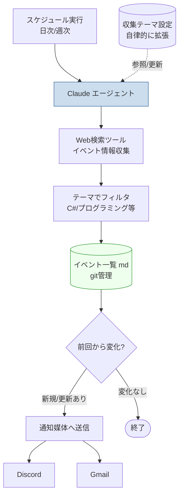

# #4 プログラミングイベント自律収集・更新

## アイデア概要（idea.md より）

- Claude のオーケストレーションで、直近開催予定のプログラミングイベントや C# 関連イベントを **自律収集**し、md 等にまとめ、開催時期などを **更新し続ける**
- 収集するテーマは **自律的に選ばせ**、参加したイベントに応じて収集テーマを随時追加
- **通知用の媒体も自律的に選ばせ**、望ましい媒体を調査させる（Discord, Gmail など）

## 結論：◎ 実現性は非常に高い。最初に着手すべき

4アイデアの中で **最も低コスト・低リスク**。スケジュール実行で定期的に Claude を走らせ、Web 検索でイベント情報を集めて md を更新し、通知する——という構成で素直に実現できる。自律ループの「型」を確立する最初のステップとして最適。

## アーキテクチャ案

| 要素 | 実現方法 |
|------|----------|
| 定期実行 | スケジュール機能（cron / Claude の routine / GitHub Actions 等） |
| 情報収集 | Claude の Web 検索（`web_search`）ツール |
| まとめ出力 | Markdown でイベント一覧を生成、git で履歴管理 |
| 更新検知 | 前回 md との差分で新規・変更イベントを抽出 |
| テーマ管理 | 設定ファイル（md/json）にテーマを保持し、Claude が随時追記 |
| 通知 | Discord Webhook / Gmail（後述の比較で選定） |

## 「テーマの自律拡張」の実現

- 収集テーマを設定ファイル（例：`themes.md`）として git 管理。
- 「参加したイベント」を記録するログを用意し、Claude がそれを見て関連テーマを提案・追記する。
- 各実行で「今回追加したテーマ」を変更履歴として残すことで、自律的な拡張を追跡可能にする。

## 通知媒体の比較（自律選定の判断材料）

idea.md は「通知媒体を自律的に選ばせ調査させる」とあるので、以下を比較軸として提示する。

| 媒体 | 長所 | 短所 | 向き |
|------|------|------|------|
| **Discord（Webhook）** | 実装が容易、リッチ表示、プッシュ性高い、個人開発で定番 | Discord利用が前提 | **第一候補** |
| **Gmail / メール** | 確実に届く、アーカイブ性、誰でも受信可 | リッチ表示弱い、迷惑メル判定リスク | サブ通知・記録用 |
| Slack | チーム連携、Webhook容易 | 個人用途ではDiscordと役割重複 | チーム運用なら |
| LINE Notify 系 | スマホ到達性 | 仕様変更・サービス動向に注意 | モバイル即時通知 |

→ **推奨：Discord Webhook を主、Gmail を従**。即時性は Discord、確実な記録はメール、と役割分担。最終的には Claude に上記を提示して選ばせる運用でよい。

## コスト

- 1日1回の収集実行であれば、1回あたり Web 検索数回＋まとめ生成で **数円〜数十円程度**。
- Haiku/Sonnet で十分。月数百円以内に収まる見込みで、4アイデア中最も安価。

## リスクと対策

| リスク | 対策 |
|--------|------|
| 情報源の不安定・誤情報 | 複数ソース照合、出典URLを md に明記 |
| 重複通知・通知過多 | 差分検知で新規/変更のみ通知、ダイジェスト化 |
| Web検索の利用上限 | 実行頻度・検索回数の上限設定 |
| 通知媒体の仕様変更 | 媒体を抽象化し差し替え可能に |

## 推奨

- **最初に着手するアイデア**として最適。小さく作って自律ループの監視・通知・git連携の型を確立する。
- ここで確立した「スケジュール実行 → 収集 → md更新 → 差分通知」のパターンは、#1 のオーケストレーション基盤にそのまま発展させられる。
- 通知は Discord Webhook から始め、必要に応じて Gmail を追加。
