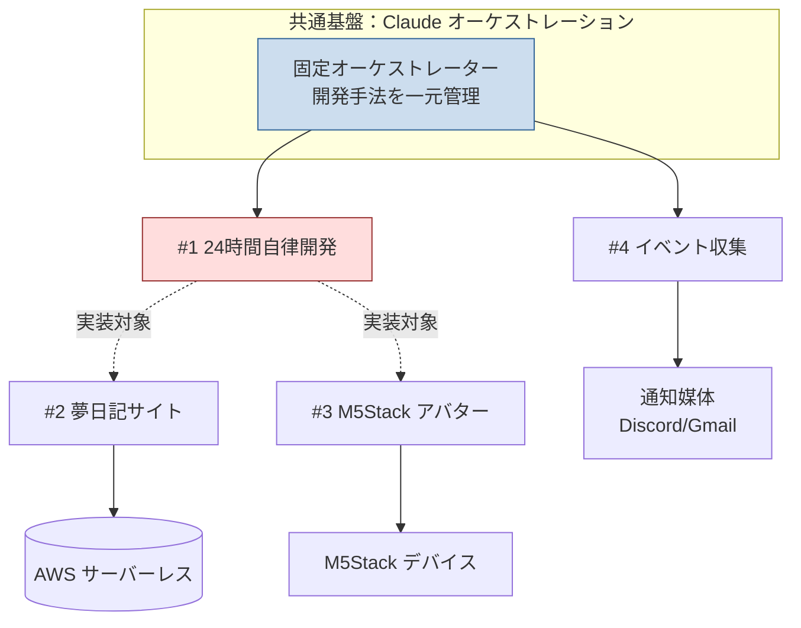
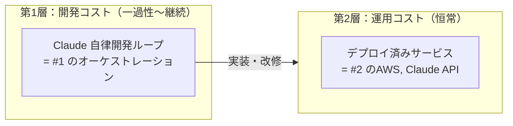

# アイデア実現可能性 精査サマリ（2026-06-21）

`idea/idea/260621/idea.md` に記載された4つのアイデアについて、技術的実現性・コスト・リスクを精査した結果をまとめる。

## 対象アイデア一覧と結論

| # | アイデア | 実現性 | 主なボトルネック | 推奨アクション |
|---|----------|--------|------------------|----------------|
| 1 | [Claude による24時間自律開発オーケストレーション](./01-autonomous-orchestration.md) | △ 条件付き | **コスト**（Opus API 従量だと月数万円〜） | サブスク定額化＋スコープ限定で段階導入 |
| 2 | [夢日記共有サイト（自律実装＆デプロイ）](./02-dream-diary-site.md) | ○ 高い | 運用コスト上限の自動制御 | サーバーレス構成で月5000円以内は十分可能 |
| 3 | [M5Stack-CoreS3-Lite サマーウォーズ風AIアバター](./03-m5stack-avatar.md) | ○ 高い | 対話AIをデバイス内に載せるか、クラウド連携か | クラウド推論＋ドット表示で実現可能 |
| 4 | [プログラミングイベント自律収集・更新](./04-event-collector.md) | ◎ 非常に高い | 情報源の安定性 | 最も低コスト・低リスク、最初に着手推奨 |

## 全体像

## 重要な前提整理：コストは「2層」で考える

このアイデア群のコストは性質の違う2層に分かれており、混同すると判断を誤る。

- **第1層（開発）**: アイデア#1 の24時間ループそのもの。Claude を動かし続ける費用で、最も高額になりうる（後述）。
- **第2層（運用）**: 完成した夢日記サイトを動かし続ける費用。idea.md の「月5000円以内」はこちらを指していると解釈した。

この2層を分けて予算管理することを強く推奨する。

## 共通リスクと推奨ガードレール

| リスク | 対策 |
|--------|------|
| 自律実行による想定外のコスト超過 | AWS Budgets / Claude API 利用上限アラート、サービス自動停止スイッチ |
| 自律デプロイによるセキュリティホール混入 | レビュー要件にセキュリティ観点を明文化（#1で一元管理）、`security-review` の自動実行 |
| 公開リポジトリへの機密情報流出 | APIキー等は環境変数・Secrets管理、`.gitignore` 徹底、push前スキャン |
| 自律ループの暴走・無限ループ | Task Budget・反復回数上限・ヒューマンチェックポイント |

## 着手順序の提案

1. **#4 イベント収集**（最小リスクで自律ループの型を確立）
2. **#1 のオーケストレーション基盤**（開発手法の一元管理を構築）
3. **#2 夢日記サイト**（#1 を使って実装、運用コスト制御を検証）
4. **#3 M5Stack アバター**（ハードウェア要素、独立して進行可）

詳細は各ファイルを参照。
